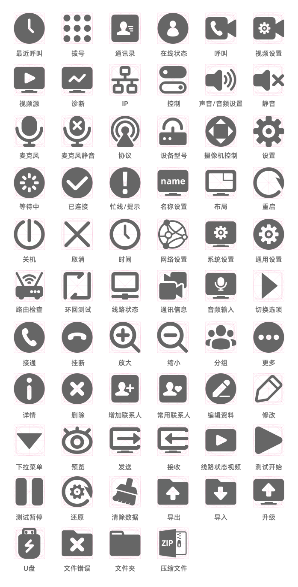
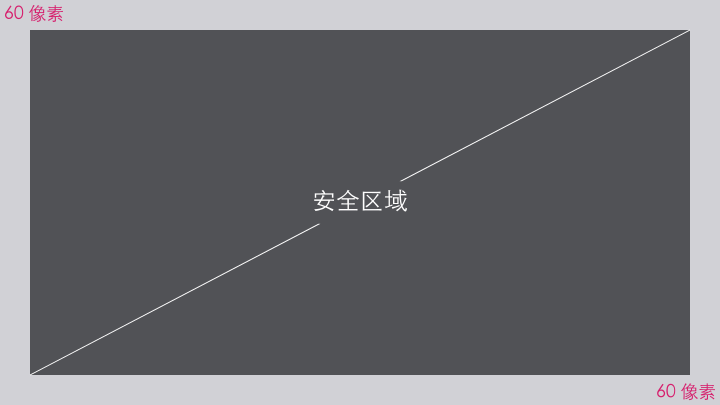

# UI 规范

> 天地阳光视频会议终端  
> 蓝湖：[https://lanhuapp.com/url/Hnrki-EMPyn](https://lanhuapp.com/url/Hnrki-hc9YN)，链接于2021年1月5日0点失效  
> ICONS：[https://wusheji.net/source/allinone_svg_icons.zip](https://wusheji.net/source/allinone_svg_icons.zip)  
> REVIEW：[https://wusheji.net/allinone/review/](https://wusheji.net/allinone/review/)

开发过程中，建议使用蓝湖中分层图的尺寸与样式。如看到蓝湖中图片尺寸默认显示为 1920 × 1080 的话，在右上方尺寸设定宽度为 3840 即可，我们的设计为 4K 尺寸。

## 颜色

### 主要

	

		

			

				<small>未选择的项目</small>
				
#000413

				
RGBA 0 04 19 70%

			

			

				<small>深色</small>
				
#46464a

				
RGB 70 70 74

			

			

				<small>背景，非全屏叠加时</small>
				
#999999

				
RGB 153 153 153

			

			

				<small>未选择的图标、文字</small>
				
#cccccc

				
RGB 204 204 204

			

		

	

### 情景

	

		

			

				<small>等待/消息</small>
				
#0099ff

				
RGB 0 153 255

				
Alpha：9%

			

			

				<small>成功/呼叫/在线</small>
				
#00cc66

				
RGB 0 204 102

				
Alpha：9%

			

			

				<small>主要/选择/警示/提醒</small>
				
#ff9900

				
RGB 255 153 0

				
Alpha：9%

			

			

				<small>错误/挂断</small>
				
#ff1400

				
RGB 255 20 0

				
Alpha：9%

			

		

	

## 文字

+ 字体：阿里巴巴-普惠体，**免费可商用**。
+ 字号（详见设计稿件中字号标准）：
  + 最大不得超过 180px，用于栏目标题，如：呼叫
  + 最小不得小于 40px，用于辅助信息显示，如：常用联系人
  

## 图标

### 删格

	

		
		
正方形

	

	

		
		
圆形

	

	

		
		
矩形横

	

	

		
		
矩形竖

	

### 图标，们

## 布局

+ 4K 屏幕标准：3840 × 2160 像素分辨率
+ 2K 屏幕标准：1920 × 1080 像素分辨率

### 安全区域设计

### 弹出窗口

+ 背景颜色：RGB 0 4 19 ，透明度：70%
+ 背景效果：高斯模糊（磨砂玻璃效果）

## 交互说明

> 通过选择一些页面，描述设计中**通用**的操作方法与一些**特殊**的需要注明的交互设计。开发过程中可以对页面交互做**合理的修改**或**优化调整**。

遥控器按键对照说明：

- 开关机：<i class="iconfont">&#xe888;</i>
- 音量键：
  音量减 <i class="iconfont">&#xe887;</i>、
  音量加 <i class="iconfont">&#xe885;</i>、
- 缩放： 
  缩小 <i class="iconfont">&#xe881;</i>、 
  放大 <i class="iconfont">&#xe87f;</i>、
- 方向键： 
  上 <i class="iconfont">&#xe880;</i>、 
  右 <i class="iconfont">&#xe886;</i>、 
  下 <i class="iconfont">&#xe88b;</i>、 
  左 <i class="iconfont">&#xe88a;</i>
- 确认：<i class="iconfont">&#xe884;</i>
- 菜单页：<i class="iconfont">&#xe88c;</i>
- 回退/返回：<i class="iconfont">&#xe882;</i>
- 热键：<i class="iconfont">&#xe88d;</i>
- 拨号/呼叫：<i class="iconfont">&#xe87e;</i>
- 清除/删除：<i class="iconfont">&#xe883;</i>
- 挂断：<i class="iconfont">&#xe87d;</i>
- 双流：<i class="iconfont">&#xe88e;</i>
- 切换画面：<i class="iconfont">&#xe88f;</i>
- 布局：<i class="iconfont">&#xe889;</i>

基本操作：
- 选择、进入下一级、确认： 确认键 <i class="iconfont">&#xe884;</i>、 方向右键 <i class="iconfont">&#xe886;</i>
- 退出、返回上一级： 返回键 <i class="iconfont">&#xe882;</i>、 方向左键 <i class="iconfont">&#xe88a;</i>

### 拨号

- 主菜单：拨号、最近呼叫、通讯录、分组

遥控器按方向键的上下键切换选择**主菜单**，右侧内容根据所选菜单切换，按遥控器**方向键**中间的确认键 <i class="iconfont">&#xe884;</i> 或方向右键 <i class="iconfont">&#xe886;</i> 则进入该菜单内容，可以对项目进行编辑。

- 进入菜单项目，默认第一项获得焦点，如“拨号”则进入后，第一项“输入 IP”获得焦点；
- 按回键 <i class="iconfont">&#xe882;</i> 取消焦点选中，再按一次返回上一级菜单；
- 若无焦点选中项，按左键 <i class="iconfont">&#xe88a;</i> 也可以返上一级菜单。

1. 通过遥控器的数字键，输入 IP ，当前获得焦点的输入框呈高亮展示，输入完成按确认键后，**呼叫图标按钮**获得焦点变为可用状态，按遥控器上的确认键 <i class="iconfont">&#xe884;</i> 或拨号键 <i class="iconfont">&#xe87e;</i> 开始呼叫；

2. 按方向下键 <i class="iconfont">&#xe88b;</i> 切换到呼叫设置（分辨率、速率、协议），方向左右键进行切换选择项目，按确认键 <i class="iconfont">&#xe884;</i> 无干扰模式调出可选项，如下图选择“分辨率”中的可选项。

3. 选择常用联系人，选中后按确认键 <i class="iconfont">&#xe884;</i> 或直接按拨号键 <i class="iconfont">&#xe87e;</i> 则开始呼叫；

### 最近呼叫

1. 在**主菜单**按方向下键 <i class="iconfont">&#xe88b;</i> 切换到第二项最近呼叫，按确认键 <i class="iconfont">&#xe884;</i> 或方向右键 <i class="iconfont">&#xe886;</i> 进入通讯录列表；
2. 同样进入该菜单内容后，默认选中第一项，通过控制**方向键**来切换选择；
3. 选择后按确认键 <i class="iconfont">&#xe884;</i> 进入无干扰模式操作；
4. 在最近呼叫中，可执行操作有：再次呼叫、查看详情、添加至通讯录、删除记录操作。
   
   

5. 查看详情界面，通过返回键 <i class="iconfont">&#xe882;</i> 可直接返回上一级页面。
   
   

### 通讯录

1. 同样在**主菜单**按方向下键 <i class="iconfont">&#xe88b;</i> 切换到通讯录列表，按确认键 <i class="iconfont">&#xe884;</i> 或方向右键 <i class="iconfont">&#xe886;</i> 进入通讯录列表，默认选中第一项。

2. 该页面有 3 个基本功能，通过四个**方向键**可自由选择：
   
   - 查看、编辑联系人
   - 新建联系人
   - 通过字母检索
  
  

3. 在列表中查看现有联系人，按确认键 <i class="iconfont">&#xe884;</i> 可执行 4 个操作：
   
   - 呼叫
   - 编辑
   - 删除
   - 设置常用
   
   

### 控制

- 主菜单：摄像机、视频、音频

#### 摄像机

1. 该项内容中“摄像机控制”与“摄像机参数-亮度”为在摄像机实际视频画面中设置，其他设置均在当前设置页面中操作：

2. 选择本地摄像机控制，则直接进入视频画面，使用遥控器的方向键、放大缩小键控制摄像机画面，所见即所得：

3. 摄像机参数-亮度，选中该项按确认键 <i class="iconfont">&#xe884;</i> 调出摄像机实际视频画面，使用方向左键 <i class="iconfont">&#xe88a;</i> 降低亮度，或右键 <i class="iconfont">&#xe886;</i> 提高亮度：

4. 通过方向下键 <i class="iconfont">&#xe88b;</i> 滚动页面，选择或者新建预置位，按确认键 <i class="iconfont">&#xe884;</i> 可对已有预置位进行操作（预览、编辑、删除）：

#### 视频

1. 表单页面中选项的切换都通过方向键控制，按确认键 <i class="iconfont">&#xe884;</i> 进入选项。选择画面分屏选项中，显示画面分屏方案与图标标识：

2. 按确认键 <i class="iconfont">&#xe884;</i> 进入选择画面分屏方案，通过方向上下键切换，按确认键 <i class="iconfont">&#xe884;</i> 保存：

#### 音频

- 选中“输入”、“输出”或其他，通过方向左右键调节音量大小；
- 选中“输入”、“输出”或其他，按音量键调节音量大小；

### 设置

- 主菜单：通用设置、系统设置、网络设置、协议设置
- Tab 菜单：进入设置菜单中，右侧内容顶部的 Tab 切换菜单；

设置页面通用基本操作：

1. 按方向左右键切换 “Tab 菜单”，在获得焦点的菜单上，按方向下键 <i class="iconfont">&#xe88b;</i> 或按确认键 <i class="iconfont">&#xe884;</i> 进入，然后可对项目执行操作；
2. 如果 “Tab 菜单”中的第一项获得焦点，再按方向左键 <i class="iconfont">&#xe88a;</i> 则返回到“主菜单”；
3. 进入 “Tab 菜单”具体设置项后，可通过方向上下键切换设置项，在获得焦点项目上按确认键 <i class="iconfont">&#xe884;</i> 执行操作，如果设置项第一个选项获得焦点，再按方向上键 <i class="iconfont">&#xe880;</i> 则返回到 “Tab 菜单”；
   
   

#### 时间与日期

- 关闭“自动设置“日期与时间：则出现“时间”与“日期”输入项；
- 日期可以通过**左右方向键**选择数字或者按确认键 <i class="iconfont">&#xe884;</i> 直接输入数字：

   

- 打开“自动设置“日期与时间：选择 NTP 服务器，默认服务器：
  
  

#### 网络设置-防火墙

TCP 端口范围、UDP 端口范围，按确认键 <i class="iconfont">&#xe884;</i> 直接输入数字改变端口范围的数值范围，通过按确认键 <i class="iconfont">&#xe884;</i> 或方向左右键切换起始范围表单：

### 快捷功能

遥控器按 <i class="iconfont">&#xe88d;</i> 展示快捷设置菜单：

